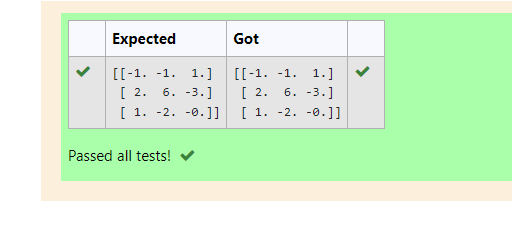

# INVERSE-OF-A-MATRIX
## Aim:
To write a python program to find the inverse of a matrix
## Equipment’s required:
1. 	Hardware – PCs
2. 	Anaconda – Python 3.7 Installation / Moodle-Code Runner
## Algorithm:
### Step1 :
 Import the numpy module to use the built-in functions for calculation

### Step 2:
prepare the list in np.array lists from each linear equations and assignay()
### Step 3: 
Using the np.linalg.solve(), we can find the solutions.
### Step 4: 
End the program

## Program:
#Program to find the inverse of a matrix.
#Developed by:Manoj Guna Sundar Tella 
#RegisterNumber:21003796
```
import numpy as np
a=np.array([[6,2,3],[3,1,1],[10,3,4]])
ar=np.linalg.inv(a)
print(ar)
```
## Output:

## Result:
Thus the inverse of given matrix is successfully solved using python program

